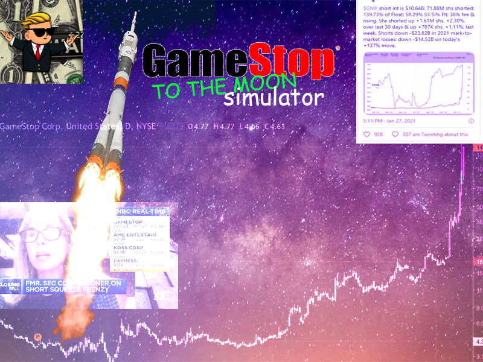

**GameStonk**

A simulation of the rise of GameStop stock. Download the files, Pygame, and then run main.py

**Inspiration**
Over the past week, we've watched as we, as well as brothers and sisters, marched boldly to the front lines of what has now been called the Revolutionary War of Finance. They tried to halt us, they tried to scare us, and they even tried to shut us down, but we held the line. This movement led to many debts being paid off, led to many billionaire tears being collected, and deeply moved everyone on our team. We know that some people may have missed out on this opportunity of a lifetime, so we created a simulation of the meteoric rise of GameStonk so everyone can experience the thrill of blowing up the shorts and train their diamond hands. 💎✋🚀🚀🚀

**What it does**
Upon running the program, you are greeted with a menu page with scenery to prepare you for the ride of your life. Once you are ready, press start. As the music begins to fade, you see a familiar sight: the moon. As $GME begins to take off, you have the opportunity to buy (keyboard's up arrow) and to sell (keyboard's down arrow). Tip: Holding the arrows does the action in rapid succession. The goal is to have as much tendies as possible before $GME takes an unplanned detour back to earth.

**How we built it**
With Pygame, sweat, hedge fund tears, and good ol' elbow grease, our project came to life. We started with a massive portrait of the WSB logo and from there we learned to scale images, display text, accept inputs, play sounds, and control the flow of the program. Before long, the lightness of our canvas had been converted to dankness.

**Challenges we ran into**
When we set out for the moon, we didn't first plan out how our simulation would be organized. It was only when we had already reached the stratosphere (a game prototype) that we realized we needed to create a menu. The problem was that the flow of our program didn't account for such a thing as a menu. Like SpaceX's rockets, we had to come back down to earth and take apart our code in order to understand the essence of our control flow in order to allow for a menu. Once back in the skies, our normal understanding of a grid system became invalid, and after much struggle and recalculation, we finally understood Pygame's grid system and starting plotting assets with ease. Sound is different in space, so we had trouble getting the Pygame mixer to play music and sounds at the times we wanted. We ended up fixing this issue by mimicking the singleton pattern and creating different sound channels. Finally, the graph of our trajectory became too taxing on the computer to the point that the whole program came to a stall, but this issue was circumvented by skipping every few points in our graph once the graph became large.

**Accomplishments that we're proud of**
After looking at our finished project, we couldn't believe what we had accomplished, especially as this is the first hackathon for everyone on our team. We went from knowing very little about Pygame to being able to immortalize a meme in code. We think our GME graph is especially cool. We're all so excited that we actually completed something that we feel over the moon.

**What we learned**
Of course, we explored a good amount of what the Pygame library has to offer. We also learned a lot about different collaboration tools to keep us connected during times of separation, like VSCode Live Share and more advanced features of Zoom.

**What's next for GameStonk Simulator**
Next stop: Mars.
